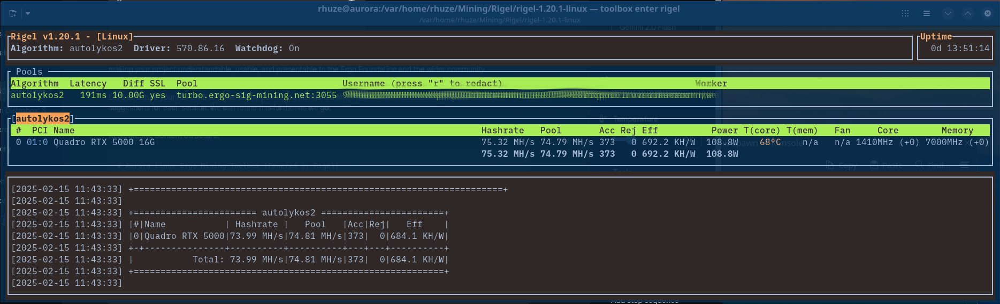

# Aurora-DX Linux Ergo Mining Toolbox (Powered by Rigel)

## Overview

This repository provides a ready-to-use Fedora Toolbox environment specifically designed and **optimized for mining Ergo (ERG) cryptocurrency on Aurora-DX Linux**, leveraging the high-performance Rigel miner for Nvidia GPUs.  It offers an exceptionally streamlined setup process, making Ergo mining incredibly accessible, particularly for users of the cutting-edge Aurora-DX Linux distribution, which comes **pre-configured with CUDA drivers**.

**Key Features:**

* **Optimized for Aurora-DX with CUDA:**  Specifically designed and tested for seamless integration with Aurora-DX Linux, leveraging its pre-installed CUDA drivers for maximum mining performance.
* **Pre-configured Rigel Miner:** Includes the latest Rigel miner, optimized for Nvidia GPUs and ready to run out-of-the-box.
* **Toolbox Isolation for Atomic Systems:** Utilizes Fedora Toolboxes, essential for Atomic Linux distributions like Aurora-DX, providing a contained and secure mining environment without compromising system stability.
* **Effortless Setup:**  Exceptionally simplified installation and usage instructions designed for Aurora-DX users, ensuring a quick start to Ergo mining.
* **Leverages Host Nvidia Drivers:**  Seamlessly utilizes the Nvidia drivers already installed and configured on your Aurora-DX host system (including CUDA on Aurora-DX Developer Edition) for optimal performance and compatibility.

## What is Aurora-DX Linux and Why Toolbox?

**Aurora-DX Linux: The Developer-Focused Atomic Powerhouse with CUDA**

Aurora-DX Linux (Developer Experience Edition) is a specialized version of Aurora Linux, built upon Fedora, and designed specifically for developers and power users.  It retains the core "Atomic" system design of Aurora Linux while providing additional tools and configurations for development workflows.  **Crucially for GPU mining, Aurora-DX comes pre-installed and configured with Nvidia drivers and the CUDA toolkit.**

**Understanding Atomic Linux Distributions**

Aurora-DX, like other "Atomic" Linux distributions, offers a fundamentally different approach to system management compared to traditional Linux distributions.  Key characteristics of Atomic distributions include:

* **Immutable Base System:** The core operating system is mounted read-only after installation. This drastically improves system stability and security, preventing accidental system modifications and making it much harder for malware to compromise the base OS.
* **Atomic Updates and Rollbacks:** System updates are transactional and atomic. Updates either apply fully and successfully, or they completely fail and rollback to the previous working state, ensuring system reliability and preventing broken updates.
* **Simplified System Management:** Atomic systems are designed for easier, more predictable, and declarative system management, reducing system administration overhead.

**The Essential Role of Fedora Toolbox for Mining on Aurora-DX**

On Atomic distributions like Aurora-DX, directly installing software onto the immutable base system is strongly discouraged to maintain system integrity and the benefits of atomicity. Fedora Toolbox provides the ideal solution for this:

* **Isolated Mining Environment:** Fedora Toolbox creates a containerized environment, providing a secure and isolated space to install and run Rigel miner and its dependencies, completely separate from your immutable Aurora-DX host system.
* **Preserves System Immutability:**  Installing Rigel within the Toolbox leaves your core Aurora-DX system untouched and pristine, ensuring the stability and security benefits of the Atomic design are fully preserved.
* **Clean and Easy Removal:**  To stop mining or remove Rigel, simply delete the Toolbox container. This leaves your Aurora-DX host system completely clean, with no residual mining software or configurations.
* **CUDA and Nvidia Driver Integration (Aurora-DX Advantage):**  The Toolbox seamlessly leverages the **pre-installed Nvidia drivers and CUDA toolkit on your Aurora-DX host system**. This is a major advantage of using Aurora-DX, as it eliminates the often complex and error-prone process of installing Nvidia drivers and CUDA within a container or directly on a traditional Linux system.  **With Aurora-DX and this Toolbox, you can start mining with minimal driver configuration hassle.**

By using Fedora Toolbox on Aurora-DX, you get the best of both worlds: the rock-solid stability and security of an Atomic Linux distribution, combined with the flexibility and ease of use for running applications like cryptocurrency miners in an isolated and manageable environment.  **Aurora-DX, with its pre-installed CUDA drivers, is the *ideal* platform for this Rigel Mining Toolbox.**

**Aurora Linux Resources:**

* [Aurora Linux Official Website](https://getaurora.dev/en) - Learn more about Aurora Linux, download ISO images, and find general information.
* [Aurora Linux Documentation](https://docs.getaurora.dev/) - Access detailed documentation, guides, and FAQs about Aurora Linux and its features.

## Prerequisites (Specifically for Aurora-DX Linux)

Before using the Rigel Mining Toolbox, ensure you have the following **already set up on your Aurora-DX Linux host system**:

1. **Aurora-DX Linux Installation:** You must have Aurora-DX Linux (Developer Experience Edition) installed and running as your primary operating system. This toolbox is **specifically designed and tested for Aurora-DX Linux.**

2. **Verified Nvidia Driver and CUDA Installation (Aurora-DX Pre-installed):**  **Aurora-DX Linux comes pre-installed with Nvidia drivers and the CUDA toolkit.**  However, it is essential to **verify that your Nvidia drivers are correctly installed and functioning on your Aurora-DX host system *before* using this toolbox.**

   * **Verify with `nvidia-smi`:** Open a terminal on your Aurora-DX host and run the command `nvidia-smi`.  If your Nvidia drivers are correctly installed, `nvidia-smi` will display detailed information about your Nvidia GPU, driver version, CUDA version, and GPU utilization. **`nvidia-smi` must work correctly on your host system for the toolbox to function.** If `nvidia-smi` fails or shows errors, you need to troubleshoot your Nvidia driver installation on your Aurora-DX host before proceeding with the toolbox.

3. **Podman:** Podman container engine must be installed and working on your Aurora-DX host. Aurora-DX includes Podman by default. Verify by running `podman --version` in your host terminal and ensure you have a recent version.

4. **Internet Connection:** Active internet connection for downloading the toolbox and for mining operations.

5. **Ergo Wallet Address:**  You need an Ergo (ERG) wallet address to receive mining rewards.

6. **Mining Pool Account (Optional but Recommended):**  While solo mining is possible, joining an Ergo mining pool is highly recommended for consistent payouts. Choose an Ergo mining pool and create an account if needed. You will need the pool's stratum URL and worker credentials.

7. **Rigel Miner Binary (Included):** The Rigel miner binary is included in the `rigel-1.20.1-linux` directory within this repository. You do not need to download it separately.

## Installation and Usage Instructions (Aurora-DX Linux)

Follow these simple steps to start mining Ergo on Aurora-DX Linux using the Rigel Mining Toolbox:

1. **Download the Repository:**
   Clone this GitHub repository to your Aurora-DX host system:

   \`\`\`bash
   git clone https://github.com/rhuze-emryk/rigel-mining-toolbox.git
   cd rigel-mining-toolbox
   \`\`\`

2. **Import the Toolbox Image:**
   Import the Fedora Toolbox image archive:

   \`\`\`bash
   podman load -i rigel-toolbox-image.tar.gz
   \`\`\`

3. **Import the Toolbox Filesystem:**
   Import the Rigel Mining Toolbox filesystem archive, creating the `rigel-mining-toolbox-image` image:

   \`\`\`bash
   podman import rigel-toolbox-filesystem.tar.gz rigel-mining-toolbox-image
   \`\`\`

4. **Create the Fedora Toolbox:**
   Create a new Fedora Toolbox named `rigel-miner-toolbox`:

   \`\`\`bash
   toolbox create --image rigel-mining-toolbox-image rigel-miner-toolbox
   \`\`\`

5. **Enter the Rigel Mining Toolbox:**

   \`\`\`bash
   toolbox enter rigel-miner-toolbox
   \`\`\`

6. **Navigate to the Rigel Miner Directory:**

   \`\`\`bash
   cd rigel-1.20.1-linux
   \`\`\`

7. **Run Rigel Miner - Start Mining Ergo!**
   Launch Rigel miner with the example command. **Remember to replace placeholders with your Ergo wallet address and pool details.**

   \`\`\`bash
   ./rigel -a autolykos2 -o stratum+ssl://pool.ergo-sig-mining.net:3054 -u YOUR_ERGO_WALLET_ADDRESS.YOUR_WORKER_NAME --log-file rigel.log --temp-limit tc[60-75]tm[90-100] -d 0
   \`\`\`

   **Crucially - Replace These Placeholders:**

   * **`YOUR_ERGO_WALLET_ADDRESS`**: Your Ergo wallet address.
   * **`YOUR_WORKER_NAME`**: Your chosen worker name (e.g., `aurora-dx-gpu1`).
   * **`stratum+ssl://pool.ergo-sig-mining.net:3054`**:  Your Ergo mining pool URL and port.

8. **Monitor Your Mining:**
   Rigel miner will display real-time hashrate and mining statistics in the terminal. Monitor your progress and earnings on your mining pool's website dashboard. Check `rigel.log` for detailed logs.

## Configuration and Advanced Options (Refer to Rigel README)

* **Full Configuration via Command Line:**  Rigel miner is extensively configurable through command-line arguments. For a complete understanding of all available options (algorithms, pools, overclocking, fan control, dual mining, etc.), **refer to the comprehensive Rigel miner README file located in the `rigel-1.20.1-linux` directory within the Toolbox.**

* **Nvidia Driver and CUDA - Aurora-DX Advantage:**  This toolbox is designed to seamlessly leverage the **pre-installed and CUDA-enabled Nvidia drivers on your Aurora-DX host system.**  You should not need to install drivers or CUDA within the Toolbox itself. Ensure your host Nvidia drivers are correctly installed and verified with `nvidia-smi` as described in the Prerequisites section.

* **GPU Overclocking, Temperature and Power Limits:**  Rigel miner offers options for GPU overclocking (`--cclock`, `--mclock`), temperature limits (`--temp-limit`), and power limits (`--pl`/`--power-limit`).  These options allow you to fine-tune your mining performance and efficiency. However, use overclocking with caution and always monitor GPU temperatures. Refer to the Rigel README for detailed explanations of these options.

* **Dual Mining and Algorithm Switching:** Rigel miner is a versatile miner that supports various algorithms and dual mining. Explore the Rigel README to learn about dual mining configurations and other supported algorithms beyond Autolykos2 (Ergo).

## Disclaimer

Cryptocurrency mining involves inherent risks, including but not limited to: hardware wear and tear, electricity costs, cryptocurrency price volatility, and potential regulatory changes. Use this toolbox at your own risk. The creators and contributors of this repository are not responsible for any financial or hardware losses incurred from using this software.

## License

This project is released under the [MIT License](LICENSE). See the \`LICENSE\` file for the full license text.

## Submission to the Ergo Foundation

This project is submitted to the Ergo Foundation for evaluation and potential funding or support. The goal is to provide an exceptionally user-friendly and robust Ergo mining solution specifically tailored for modern Atomic Linux distributions like Aurora-DX, thereby significantly lowering the barrier to entry for new Ergo miners on Linux.

---

**Important Note:** This toolbox is **specifically designed, tested, and supported for Aurora-DX Linux.**  While it *might* function on other Fedora-based systems or other Linux distributions, compatibility and functionality on non-Aurora-DX systems are **not guaranteed and are not officially supported.**  Using this toolbox on other distributions is at your own risk and may require significant adjustments and troubleshooting.  For the best and most reliable Ergo mining experience with this toolbox, **Aurora-DX Linux is highly recommended.**
\`\`\``
